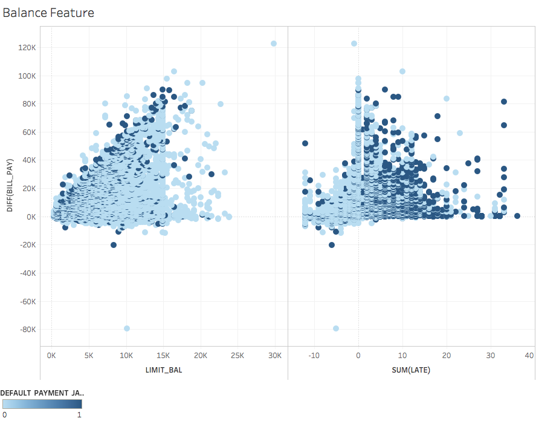
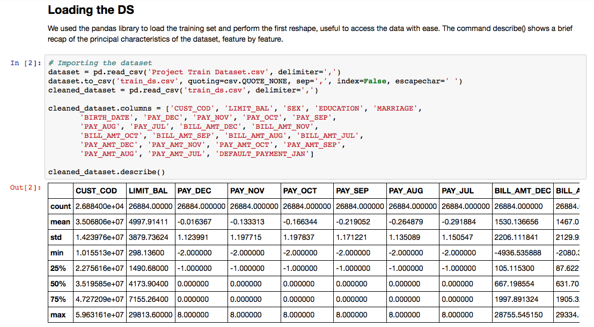
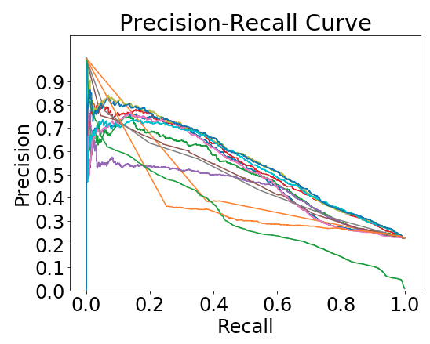

# Data-Mining-Project

The repository contains the project did for the Data Mining Course at @Polimi (Politecnico di Milano - EIT Data Science Master Programme)

## The Team

The team was composed by Riccardo Lo Bianco, Eugenio Lomurno, Filippo Pedrazzini and Alessandro Terragni.

## Description

The objective of the course was to simulate a real business problem that can be solved using Machine Learning algorithms. 

## Imlementation Tools

After visualized the Data with Tableau, we used many Python libraries such as Scikitlearn and Pandas to import and process the data. 

Heere some screenshots of the project.

## Data Visualization (Tableau)

## Data Preprocessing

## Model Selection

